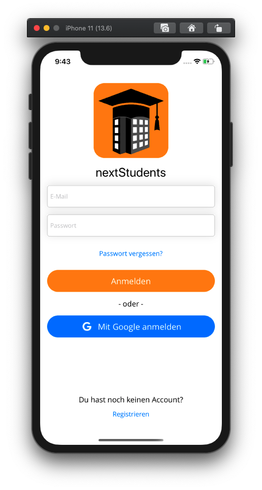

# nextDoor

[![Swift Version][swift-image]][swift-url]
[![Build Status][travis-image]][travis-url]
[![License][license-image]][license-url]
[](http://cocoapods.org/pods/LFAlertController)

This iOS app was a project in the master module "Mobile Applications" at the [RheinMain University of
Applied Sciences](https://www.hs-rm.de/de/) in the summer semester 2020.

## Overview



## Requirements

* Xcode 11.5
* Swift 5.2+
* iOS 13.5+
* [Firebase](https://firebase.google.com)

## Initial setup, build tools and dependencies
The nextDoor-App is built using Swift and [Firebase](https://firebase.google.com). The Dependencies are managed using [CocoaPods](https://cocoapods.org).

Install the pods and open the `nextDoor.xcworkspace` file to see the project in Xcode.

```
cd /path/to/nextDoor
pod install
open nextDoor.xcworkspace
```

## Configuration

See the Google Firebase documentation how to build an firebase account. Download your generated `GoogleService-Info.plist` file and copy it to the root directory of the sample you wish to run.

## License

nextDoor is licensed under the MIT license. See [LICENSE-file](./LICENSE) for details.

## Copyright

Copyright (c) 2020 [Tim Kohlstadt](mailto:tim.kohlstadt@blun.org) and [Benedict Zendel](mailto:benedict.zendel@student.hs-rm.de).


[swift-image]:https://img.shields.io/badge/swift-5.2-orange.svg
[swift-url]: https://swift.org/
[license-image]: https://img.shields.io/badge/License-MIT-blue.svg
[license-url]: LICENSE
[travis-image]: https://img.shields.io/travis/dbader/node-datadog-metrics/master.svg?style=flat-square
[travis-url]: https://travis-ci.org/dbader/node-datadog-metrics
[codebeat-image]: https://codebeat.co/badges/c19b47ea-2f9d-45df-8458-b2d952fe9dad
[codebeat-url]: https://codebeat.co/projects/github-com-vsouza-awesomeios-com